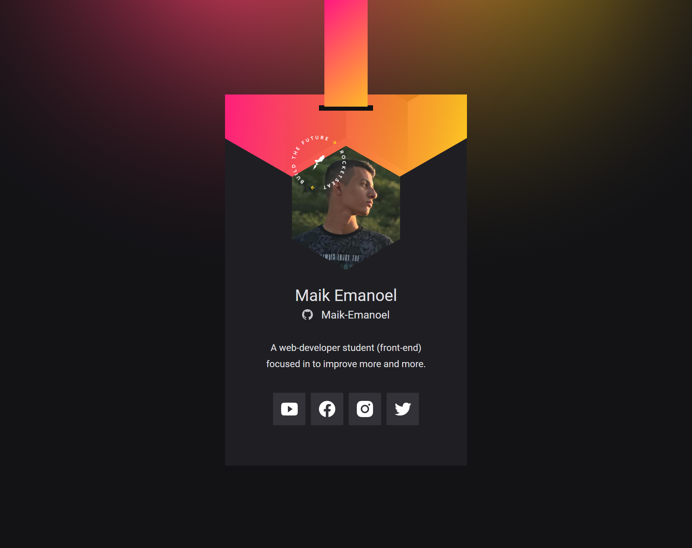

<h1 align="center"> Virtual Badge </h1>

[Clique aqui para acessar](https://maik-emanoel.github.io/virtual-card/)

  <a href="#-tecnologias">Tecnologias</a>&nbsp;&nbsp;&nbsp;|&nbsp;&nbsp;&nbsp;
  <a href="#-projeto">Projeto</a>&nbsp;&nbsp;&nbsp;|&nbsp;&nbsp;&nbsp;
  <a href="#-layout">Layout</a>

## 🚀 Tecnologias

Esse projeto foi desenvolvido com as seguintes tecnologias:

- HTML
- CSS
- JavaScript
- Git and GitHub

## 💻 Projeto

Este é um projeto de um crachá virtual com links para as redes sociais do usuário e com foto de perfil e biografia conectados com o GitHub através da API.  
Obs: Projeto construído no evento NLW Heat na trilha Origin realizado pela [Rocketseat](https://rocketseat.com.br).

## 🔖 Layout

Você pode visualizar o layout do projeto através [DESSE LINK](https://www.figma.com/file/8LPDBwBk7BFf8btbc98tgw/%5BNLW-Heat---Mission%3A-Origin%5D-DoWhile2021/duplicate). É necessário ter conta no [Figma](https://figma.com) para acessá-lo.